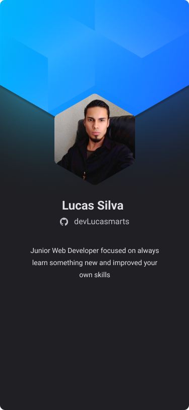

<h1 align="left">Hi, I'm Lucas 🖖 </h1>

## I build things for the Web
- 👨‍💻 I’m currently open to work.
- 💻 I’m currently learning Docker.
- 📚 You can find my study notes here https://lmarts.dev/blog
- ▶️ I just started a YouTube channel: [Subscribe!](https://www.youtube.com/channel/UC94jIdz2AHEVSrc3lTdXvyQ)
- Let's connect [linkedin](https://linkedin.com/in/lucassilvamarts)
- Let's talk [email](martssilvapro@gmail.com)

 

### Languages and Tools 🧰:

  

  
  
  

  

#

 
<h3>👨‍💻 devLucasmarts Coding Journey</h3>

   I'm a Full Stack Web Developer located in Brazil. My programming journey started at 2018 studing Java as autodidact and at 2020 I decided to improve and formalize my studies at Trybe, a programming school specialized in training web developers able to face the challenges of the market.
   My skills are specialized in JavaScript ecosystem, and I'm always learning something new or just improving what I already know.

[website]: https://holistic-developer.com/
[youtube]: https://www.youtube.com/
[instagram]: https://www.instagram.com/
[linkedin]: https://linkedin.com/in/lucassilvamarts
[portfolio]: https://github.com/LucasSilvaMarts

