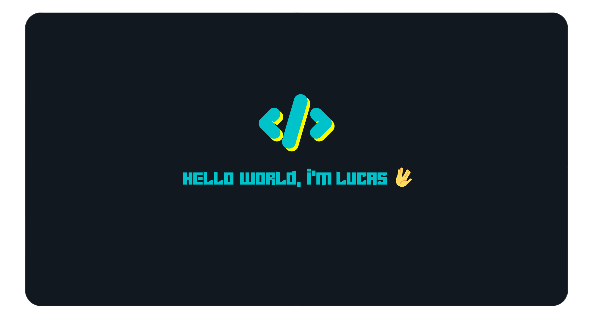

 

<h3 align="center">🚨New account🚨</h3>
 

## I build things for the Web
- 👨‍💻 I’m currently open to work.
- 💻 I’m currently learning TypeScript.
- 📚 You can find my study notes here https://lmarts.dev/blog

 

### Languages and Tools 🧰:
 

 
 
 
 

 

  
  
   

[website]: https://holistic-developer.com/
[youtube]: https://www.youtube.com/
[instagram]: https://www.instagram.com/
[linkedin]: https://linkedin.com/in/lucassilvamarts
[portfolio]: https://github.com/LucasSilvaMarts

